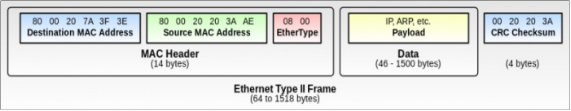

**Rapport Réseaux**

1. **Exploration des outils de reconnaissance réseau**
- **Nmap (Network Mapper) :**

  Cette commande lance des scripts pour identifier les vulnérabilités connues sur l’hôte

- **Permet de :**
- Découvrir les hôtes actifs sur un réseau.
- Identifier les ports ouverts, les services exécutés et leur version.
- Évaluer les vulnérabilités potentielles en utilisant des scripts spécifiques. 

  Elle utilise différentes options pour scanner des réseaux parmi elles on a :

1. **Balayage d'hôtes actifs :**

nmap -sn 192.168.1.0/24

1. Cette commande effectue un balayage sans port (-sn) pour détecter uniquement les hôtes actifs sur le réseau.
1. Idéal pour identifier rapidement les machines allumées sans interagir directement avec leurs services.
1. **Balayage des ports :**

nmap -p 1-65535 192.168.1.100

1. Explore tous les ports (de 1 à 65535) sur une machine spécifique pour déterminer lesquels sont ouverts.
1. Utile pour identifier les services exposés par un hôte.

1. **Identification des services et versions :**

nmap -sV 192.168.1.100

1. Permet de détecter les versions des services exécutés sur les ports ouverts.
1. Exemple : un port 22 ouvert pourrait indiquer un service SSH fonctionnant sous OpenSSH.
1. **Balayage avec détection des OS :**

nmap -O 192.168.1.100

1. Utilise des empreintes pour deviner le système d'exploitation de l'hôte distant.
1. **Utilisation de scripts NSE (Nmap Scripting Engine) :**

nmap --script vuln 192.168.1.100

- Cette commande lance des scripts pour identifier les vulnérabilités connues sur l'hôte.
- **Netcat (nc) :**

  C’est un outil polyvalent pour tester la connectivité réseau et interagir directement avec des hôtes via des ports.

- **Elle Permet :**
  - La Connexion à des hôtes distants via des ports spécifiques.
  - ` `La Configuration de Netcat pour écouter un port et attendre des connexions entrantes.
  - L’Usage de Netcat pour tester la connectivité réseau ou comme outil de diagnostic.

Elle utilise différentes options parmi elles on a :

1. **Connexion à un service distant :**

nc 192.168.1.100 80

1. Permet de se connecter au port 80 (HTTP) d’un hôte distant.
1. Utile pour envoyer des requêtes manuelles à des services réseau.
1. **Écoute d'un port :**

nc -lvp 4444

1. Configure Netcat pour écouter sur le port 4444.
1. Fréquemment utilisé pour tester des connexions entrantes ou lors de transferts de fichiers.
1. **Transfert de fichiers avec Netcat :**
   1. **Côté émetteur :**

      nc -lvp 4444 < fichier.txt

   1. **Côté récepteur :**

      nc 192.168.1.100 4444 > fichier.txt

   1. Pratique pour échanger des fichiers sans configuration complexe.
1. **Test de connectivité :**

nc -zv 192.168.1.100 20-25

1. Vérifie si les ports 20 à 25 sont ouverts sur un hôte.
1. Le paramètre -z effectue un balayage sans ouvrir de session complète, tandis que -v (verbose) affiche les résultats en détail.
1. **Resumé :**
- **Nmap** est indispensable pour découvrir des informations sur le réseau et les machines qui y sont connectées.
- **Netcat** est un couteau suisse permettant de tester rapidement la connectivité, d'envoyer des données ou d'écouter des connexions entrantes.
- En combinant les deux outils, vous pouvez cartographier un réseau, identifier des services vulnérables et interagir avec eux directement pour des tests ou des attaques simulées.

**II. Analyse des paquets et des protocoles**

- **Tcpdump :**

  C’est un outil qui permet de capturer et analyser des paquets réseau directement depuis le terminal. Il diagnostique aussi les problèmes réseau ou observer les échanges entre machines.

- **Commandes explorées :**
1. **Capture basique de paquets :**

tcpdump

1. Par défaut, Tcpdump capture tout le trafic réseau sur l’interface principale.
1. Fournit une vue brute des paquets échangés.
1. **Filtrage par protocole :**

tcpdump -i eth0 icmp

1. Capture uniquement les paquets ICMP (comme les requêtes de ping) sur l'interface eth0.
1. Utile pour isoler des protocoles spécifiques.
1. **Capture par adresse IP :**

tcpdump host 192.168.1.100

1. Montre uniquement les paquets échangés avec l’hôte spécifié.
1. Très utile pour surveiller une machine particulière sur le réseau.
1. **Filtrage par port :**

tcpdump port 80

1. Affiche uniquement le trafic échangé sur le port HTTP (80).
1. Peut être combiné avec d’autres filtres comme src, dst, etc.
1. **Enregistrement dans un fichier :**

tcpdump -w capture.pcap

1. Sauvegarde les paquets capturés dans un fichier .pcap pour une analyse ultérieure.
1. Idéal pour travailler ensuite avec un outil graphique comme Wireshark.
1. **Lecture d’un fichier PCAP :**

tcpdump -r capture.pcap

1. Permet d’afficher les paquets d’une capture précédemment sauvegardée.
- **Wireshark :**

  C’est un Analyseur graphique des paquets capturés pour une exploration approfondie des protocoles et des échanges réseau. Il permet de détecter des anomalies, décoder des échanges et extraire des données spécifiques.

- **Fonctionnalités explorées :**
1. **Filtrage des protocoles :**
   1. Exemple : http, tcp, icmp, ou udp dans la barre de filtres.
   1. Permet de se concentrer sur un protocole spécifique pour une analyse ciblée.
1. **Analyse de flux (Stream Analyses) :**
   1. Clic droit sur un paquet > **"Follow à TCP Stream"** ou **"Follow à HTTP Stream"**.
   1. Affiche les échanges complets d’une session, pratique pour comprendre le contexte d’une requête ou d’une réponse.

1. **Recherche dans les paquets :**
   1. Recherche de chaînes spécifiques comme par exemple : flag, password, dans le contenu des paquets.
   1. Utile pour extraire des informations sensibles ou cachées.
1. **Exportation des objets :**
   1. Menu : **File > Export Objects > HTTP**.
   1. Permet d’extraire des fichiers ou des données échangées sur HTTP.
   1. Utilisé dans un défi pour découvrir un fichier contenant un flag.
- **Resumé :**
- Tcpdump est un outil puissant pour capturer rapidement des données réseau en ligne de commande.

Il est léger et permet de capturer tout ou partie du trafic en fonction de critères précis.

- Wireshark complète Tcpdump avec une interface graphique conviviale pour analyser les captures en profondeur.

Ses outils d’exportation et de suivi de flux facilitent la recherche de données spécifiques dans des captures complexes.

**III. Manipulation des paquets**

- **Scapy :**

Scapy est un logiciel et un module pour Python permettant de forger, envoyer, réceptionner et manipuler des paquets réseau.

- **Permet :**
  - Génération et envoi de paquets Ethernet, IP, TCP/IP pour des tests et des simulations.
  - Construction de paquets ARP pour rediriger du trafic ou répondre à des requêtes spécifiques.
  - Utilisation avancée de champs comme seq, ack, et les flags TCP (SYN, ACK).
- **Composition et manipulation des paquets avec Scapy**
- **Comprendre les Paquets Réseau :** 
1. **Les paquets réseau** sont des unités de données formées de plusieurs couches, chacune correspondant à une étape du processus de communication :
   1. **Couche lien (Ethernet)** : Permet la transmission des données sur le réseau local.
   1. **Couche réseau (IP)** : Dirige les données vers leur destination en utilisant des adresses IP.
   1. **Couche transport (TCP/IP)** : Assure une communication fiable et ordonnée entre les hôtes.
1. **Structure d’un paquet :** Chaque couche ajoute un en-tête contenant des informations essentielles, comme :
   1. La source et la destination (MAC pour Ethernet, IP pour la couche réseau).
   1. Les ports et flags (TCP pour la couche transport).

- **Manipulation des Paquets Ethernet**
1. **Rôle et Fonctionnalité :**
   1. Le protocole **Ethernet** constitue la base de toutes les communications réseau dans un LAN (Réseau local).
   1. Il identifie les appareils via des adresses MAC uniques.
   1. Permet des transmissions ciblées (unicast) ou à large diffusion (broadcast).

      Voici la structure qu'une trame Ethernet doit présenter :

      

      Le **CRC** permet le contrôle d'intégrité de la trame : si on le modifiait, la trame deviendrait invalide et inutile. Il ne nous reste donc que 3 champs modifiables :

      1. **dst** : représente l'adresse mac du destinataire
      1. **src :** représente l'adresse mac de l'émetteur
      1. **Type** : représente le type de protocole (dépend du contenu de la partie "data" dans notre cas vide)
1. **Créer un paquet Ethernet :**
   1. **Utilisation de Scapy** pour générer un paquet Ethernet avec une adresse de diffusion 

      **Code: Python**

      *from scapy.all import Ether*

      *packet = Ether(dst="ff:ff:ff:ff:ff:ff")*

      *sendp(packet)*

      *.*

      *Sent 1 packets.*

*NB : Dans le jargon Scapy, un point "." représente un envoi.*

- **Ajout de la Couche Réseau (IP)**
1. **Concept de la Couche IP :**
   1. Fournit un moyen de router les paquets d’un réseau à un autre via des adresses IP.
   1. Champs clés observés :
      1. **Adresse source (src)** : IP de l’expéditeur.
      1. **Adresse destination (dst)** : IP du destinataire.
1. **Créer un paquet IP avec Scapy :**
   1. Ajout d’une destination spécifique au paquet :

`         `**Code: Python**

*from scapy.all import IP*

*ip\_packet = IP(dst="192.168.1.1")*

*send(ip\_packet.show())*

***Explication***

« from scapy.all import IP »

- Cette ligne importe la classe IP du module Scapy.
- La classe IP permet de créer et de manipuler des paquets IP (Internet Protocol)
- **dst="192.168.1.1"** : Définit l'adresse IP de destination du paquet

**send(ip\_packet)** :

- Enverra un paquet IP vide (sans charge utile) à l'adresse 192.168.1.1
1. **Combinaison Ethernet + IP :**
   1. Superposition de couches :

`     `**Code: Python**

*from scapy.all import Ether, IP*

*packet = Ether(dst="ff:ff:ff:ff:ff:ff") / IP(dst="192.168.1.1")*

*sendp(packbet,* *iface="eth0")*

**Explication :**

- **packet = Ether(dst="ff:ff:ff:ff:ff:ff") / IP(dst="192.168.1.1")**

Cette ligne crée une trame Ethernet contenant un paquet IP.

- **Ether(dst="ff:ff:ff:ff:ff:ff")**:

Définit une trame Ethernet avec l'adresse MAC de destination :

- **ff:ff:ff:ff:ff:ff** : Adresse de diffusion (broadcast).
- La trame sera envoyée à **tous les appareils** sur le même réseau local.
- **IP(dst="192.168.1.1")** :
  - Définit un paquet IP avec , **dst="192.168.1.1"** : L'adresse IP de destination.
  - Par défaut, l'adresse IP source sera remplie automatiquement par Scapy en fonction de votre configuration réseau.
- **/** : slash
- En Scapy, l'opérateur / est utilisé pour encapsuler ou empiler des couches de protocole.
- Ici, il empile un paquet IP dans une trame Ethernet.
- sendp(packet, iface="eth0") 

Envoie la trame via l'interface eth0

- **Ajout de la Couche Transport (TCP)**
1. **Comprendre TCP :**

`         `Le protocole TCP est un protocole qui garantit une transmission fiable grâce à :

1. Des numéros de séquence pour suivre les données.
1. Un mécanisme de vérification appelé handshake.
1. Le handshake TCP suit trois étapes :
   1. **SYN** : Début de la connexion.
   1. **SYN-ACK** : Confirmation par le serveur.
   1. **ACK** : Finalisation par le client.

      

1. **Étape 1 (SYN)** : Le client veut se connecter au serveur. Il envoie un message avec le flag **SYN** pour dire qu'il souhaite commencer une communication et indique un numéro de séquence de départ.
1. **Étape 2 (SYN + ACK)** : Le serveur répond avec un message **SYN-ACK**. Cela signifie qu'il a reçu la demande du client (**ACK**) et qu'il est prêt à démarrer une communication avec son propre numéro de séquence (**SYN**).
1. **Étape 3 (ACK)** : Le client envoie un dernier message **ACK** pour confirmer qu'il a ru la réponse du serveur. La connexion est alors établie, et ils peuvent commencer à échanger des données.

**Créer un paquet TCP avec Scapy :**

Voici les **flags TCP les plus utilisés** et leur rôle :

- **S (SYN)** : Utilisé pour initier une connexion TCP.
- **A (ACK)** : Confirme la réception de données ou d'autres messages.
- **F (FIN)** : Sert à terminer une connexion TCP proprement.
- **R (RST)** : Réinitialise une connexion en cas de problème ou de connexion incorrecte.
- **P (PSH)** : Demande au destinataire de traiter immédiatement les données.
- Construction d’un paquet TCP avec un drapeau(flag) SYN :

`             `**Code: Python**

*from scapy.all import TCP*

*tcp\_packet = TCP (dport=80, flags="S")*

*send(tcp\_packet)*

**Explication :**

- Le code actuel **tente d'envoyer** un paquet TCP avec un drapeau SYN au port 80. Cependant, sans la couche IP, il est incomplet et ne pourra pas atteindre la destination.

tcp\_packet = TCP(dport=80, flags="S")

- **TCP** : Crée un paquet TCP.
- **dport=80** : Spécifie le port de destination. Ici, le port 80 est utilisé, qui est le port standard pour les communications HTTP.
- **flags="S"** : Définit le drapeau TCP à SYN, qui est utilisé pour initier une connexion TCP dans le processus de handshake.

1. **Combinaison Ethernet + IP + TCP :**
   1. Superposition complète des couches :

`          `**Code: Python**

*from scapy.all import Ether, IP, TCP*

*full\_packet = Ether(dst="ff:ff:ff:ff:ff:ff") / IP(dst="192.168.1.1") / TCP(dport=80, flags="S")*

*sendp(full\_packet)*

**Explication :**

Ce paquet complet encapsule :

1. Une couche Ethernet pour l'adresse MAC.
1. Une couche IP pour l'adresse réseau.
1. Une couche TCP pour établir une connexion.

- **Exploration Avancée (ARP et Spoofing)**
1. **Protocole ARP :**

ARP associe les adresses IP aux adresses MAC dans un réseau local.

1. Exemple d’un paquet ARP :

**Code: Python**

*from scapy.all import ARP*

*arp\_packet = ARP(op="who-has", pdst="192.168.1.1")*

*send(arp\_packet)*

**Explication :**

arp\_packet = ARP(op="who-has", pdst="192.168.1.1")

- ARP() : Cette fonction crée un paquet ARP. Par défaut, Scapy remplit automatiquement certains champs si vous ne les spécifiez pas.
- Paramètres utilisés :
  - op="who-has" : Spécifie l'opération ARP.
    - "who-has" est une requête pour demander l'adresse MAC associée à une adresse IP spécifique.
    - "is-at" serait une réponse ARP pour indiquer que l'adresse MAC associée est connue.
  - pdst="192.168.1.1" : Définit l'adresse IP cible pour laquelle vous demandez l'adresse MAC.

En résumé, ce paquet demande "Qui possède l'adresse IP 192.168.1.1 ?" sur le réseau local

1. **Spoofing avec ARP :**
   1. Simulation d’une fausse réponse ARP pour rediriger le trafic :

`   	`**Code: Python**

*from scapy.all import ARP, Ether*

*spoofed\_packet=Ether(dst="ff:ff:ff:ff:ff:ff")/ ARP(op="is-at", psrc="192.168.1.1", hwsrc="00:11:22:33:44:55")*

*sendp(spoofed\_packet)*

**Explication :**

Ce code met en œuvre une **attaque d'usurpation ARP (ARP spoofing)** en créant un paquet ARP falsifié. Voici une explication détaillée de chaque ligne :

“from scapy.all import ARP, Ether”

- **ARP** : Permet de créer des paquets ARP.
- **Ether** : Permet de construire une trame Ethernet, qui encapsulera le paquet ARP.
- **Création du paquet ARP falsifié**

spoofed\_packet = Ether(dst="ff:ff:ff:ff:ff:ff") / ARP(op="is-at", psrc="192.168.1.1", hwsrc="00:11:22:33:44:55")

- **Ether(dst="ff:ff:ff:ff:ff:ff")** :
  - Spécifie l'adresse MAC de destination.
  - "ff:ff:ff:ff:ff:ff" est l'adresse de broadcast Ethernet, donc ce paquet sera diffusé à tous les appareils du réseau local.
- **ARP()** : Définit le contenu du paquet ARP :
  - **op="is-at"** : Indique que c'est une réponse ARP. Dans une réponse normale, un appareil dit : "Je suis à cette adresse MAC pour cette IP."
  - **psrc="192.168.1.1"** : Spécifie l'adresse IP source usurpée. Cela signifie que l'attaquant prétend être l'appareil avec l'IP **192.168.1.1**.
  - **hwsrc="00:11:22:33:44:55"** : Définit l'adresse MAC falsifiée associée à **192.168.1.1**. Ici, l'attaquant prétend que cette adresse MAC correspond à l'IP usurpée.

    En résumé, ce paquet dit aux appareils du réseau local :

- "L'IP **192.168.1.1*** est associée à l'adresse MAC **00:11:22:33:44:55**."
- Le paquet est diffusé sur le réseau local, et tous les appareils qui reçoivent ce paquet mettront à jour leur table ARP (cache ARP) avec cette information falsifiée.

**Conséquences de l'usurpation ARP**

Une fois ce paquet envoyé :

1. Les appareils du réseau croiront que l'IP **192.168.1.1** correspond à l'adresse MAC **00:11:22:33:44:55** (falsifiée).
1. Cela permet à l'attaquant de :
   1. Intercepter le trafic destiné à l'IP usurpée.
   1. Mener une attaque de type **Man-in-the-Middle (MITM)**.
   1. Perturber les communications normales du réseau.

***NB :*** 

- **Sendp ()** : Permet d'envoyer des paquets au niveau 2 (liaison de données), comme Ethernet.
- **Send ()** : Envoie des paquets au niveau du réseau (couche 3), tels que des paquets IP, TCP, ou UDP.

**Résumé des outils utilisés**

- **Nmap, Netcat (nc) : Reconnaissance** réseau et diagnostic
- **Tcpdump**, **Wireshark** : Analyse et extraction de données dans des fichiers pcap.
- **Scapy** : Manipulation et génération de paquets.

**Conclusion :**

En explorant ces aspects, nous avons couvert des domaines clés en sécurité réseau, reconnaissance, analyse de paquets, et manipulation.

**Fait par** : Seydina Oumar

